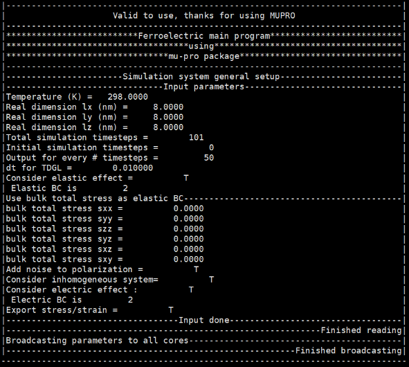

After the program started, some information will be printed to the screen as shown in Figure \ref{fig:quick-example-screen-output}.

After the program finished, you will get some output data files, all of which are in columnar pattern similar to the **Polar.in** file, that first three column define the position for data point, and then rest of the columns are data at each grid point. You may process the data or visualize it use the tools you're most familiar with.

We have provided several examples in out \muferro distributions including this quick tutorial files, but in the future when you are supposed to prepare these files yourself. It may be a daunting task for beginners, that's why we have this manual and some other tools to help you out.

For the creating the \textbf{input.in} file, you should refer to the Chapter \ref{chapter:input} and find the keyword you need for your specific case. For the \textbf{Polar.in} file, we prepared a small program called "Structure-Generator" that will help you create some commonly used or geometrically simple domain structures. And lastly, for the \textbf{pot.in} file, we are building an online database for phenomenological thermodynamic parameters, in the future you may want to download potential files from the website directly. For now, we put the thermodynamic parameters for some common materials in the "potentials" folder in the ferroelectric directory of \muferro distribution. But of course, you can use your own parameters for the potential file. The \textbf{pot.in} file is in the JSON format, you are allowed to change the value (number or string after the colon), but not the keys (the string before the colon, which is the name for the parameter we used in our simulation). Once the keys are changed, we can no longer find all of the value needed for simulation, and the program may crash. 

The post processing can also be quite challenging sometimes. We also prepare some gnuplot scripts, as well as a visualization GUI based on VTK+Qt to help you get started with the process. When you have more sophisticated visualization needs, you may find the right one that suits you the most.
